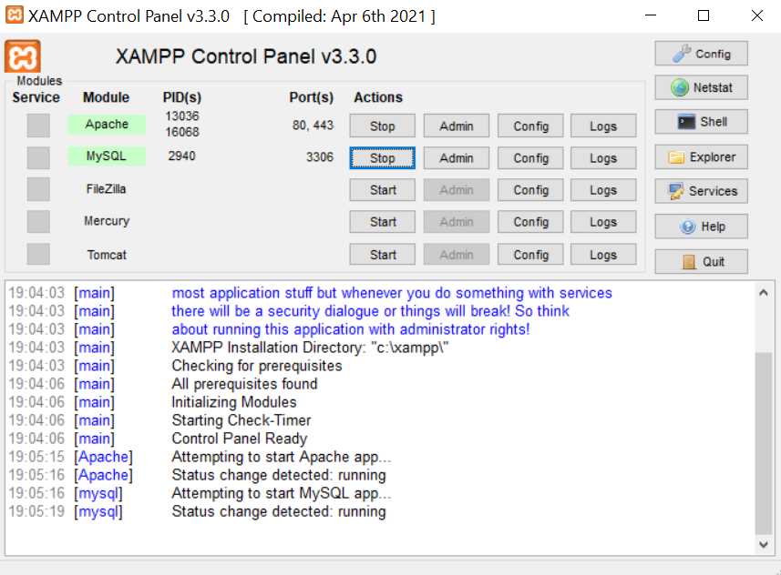

  

 

# Projeto para Feira Tecnológica 2024

## Descrição

A Open Book é o um projeto multiplataforma, ou seja, possui múltiplas aplicações. A Open Book Web é uma aplicação e-commerce e de gerenciamento de livraria e os seus clientes.

<ul>
  <li>
    <a href="https://github.com/mathsant-js/Projeto_Livraria_Desktop">Open Book - Desktop</a>
  </li>
  <li>
    <a href="https://github.com/mathsant-js/Projeto_Livraria_Mobile/tree/reworked">Open Book - Mobile</a>
  </li>
</ul>

## Requisitos Para Testar a Aplicação
1. Possuir o XAMPP
2. Baixar o Repositório em sua máquina

## Etapas

1. Baixar o repositório, na pasta htdocs, que está no xampp. Caminho (Caminho comum): C:\xampp\htdocs
2. Ligar o Apache e o MySQL do Xampp. Veja na imagem abaixo: 
 

3. Digitar o seguinte link no seu navegador: <i>localhost/Projeto_Livraria_Web/src/views/index.php?acao=semacao</i>
 
4. Pronto, agora você pode ver como funciona a Open Book Web!

### 
Desenvolvedores:

<ul>
  <li>Matheus Jorge Santana: <a href="https://github.com/mathsant-js" target="_blank">mathsant-js</a></li>
  <li>Lucas Tino Rosa: <a href="https://github.com/Lucas-Tino">Lucas-Tino</a></li>
</ul>
